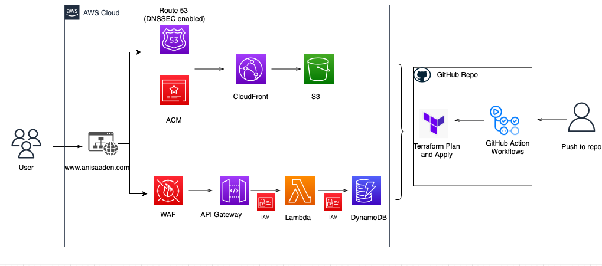

# cloud-resume-challenge

The [Cloud Resume Challenge](https://cloudresumechallenge.dev/docs/the-challenge/aws/) is a hands-on project designed by [Forrest Brazeal](https://twitter.com/forrestbrazeal) to help newbies bridge the gap from cloud certification to cloud job. It incorporates many of the skills that real cloud and DevOps engineers use in their daily work.

I chose to do the AWS version with Terraform as my language of choice for the IaC part. Below is a summary of the project, resources I found useful and a view of the current architecture. 

## Certification 
I already had both the AWS Cloud Certified Practioner and AWS Solutions Architect Associate prior to starting the challenege so I was able to skip ahead to step 2. I found the [A Cloud Guru](https://acloudguru.com) and [WhizLabs](https://www.whizlabs.com) practice tests really useful for studying for this certs.

## Frontend 

I am not a front end developer, nor do I have a creative bone in my body. So for the HTML and CSS part of the code, I pretty much did the bare minimum (as is painfully evident from the finished product). 

Since I'd already played around with the AWS console in labs while prepping for the AWS SAA, setting up and getting S3, CloudFront and Route 53 all working together was easy. I did struggle with getting my web page to serve over HTTPS but that turned out to be a misconfigured alias record (Note: it pays to learn about DNS and the different record types). With the help of [this article](https://aws.amazon.com/premiumsupport/knowledge-center/cloudfront-https-requests-s3/), I got there in the end.

## Backend

Believe it or not, the hardest part of the challenge for me was the JavaScript part, I could not get my visitor count to appear and update on my web page. I knew everything was working fine together as I tested the API endpoint on Postman so I went down the YouTube rabbit hole and found the AMAZING [The Net Ninja](https://www.youtube.com/c/TheNetNinja), between his videos and this awesome reddit answer to [Can someone explain to me what is Cross-Origin Resource Sharing(CORS) in the most simplest terms?](https://www.reddit.com/r/learnjavascript/comments/pzuy6h/can_someone_explain_to_me_what_is_crossorigin/), I was finally able to get an updated visitor count on my web page. 

There were a few other issues that propped up e.g. errors while testing my lambda function, but the AWS documenation is very detailed and I was always able to find the solution in there.

## Automation

One of my cloud related goals was to get the HashiCorp Terraform Associate certificate so it made sense for me to use Terraform for the IaC part. I had never used Terraform before so I started off with [this course](https://www.youtube.com/watch?v=V4waklkBC38&t=4283s) from freeCodeCamp. That, along with the [Terraform documentation for AWS](https://registry.terraform.io/providers/hashicorp/aws/latest/docs) was enough to help me with deploying both my front and back end infrastructure with Terraform. I really struggled with deploying API Gateway so I'm not sure if it's deployed *the right way*, but it works.

Next up was testing and setting up the CI / CD pipeline, I'll be honest I didn't spend much time on the testing part but [Emily Shea](https://emshea.com) has some really good blog posts and tutorials on testing, check out her blog posts and git repository. I understood the basics of testing, use cases etc but my test is very basic and only checks for a status code. 

For the CI / CD pipeline, I had to set up Git Actions, I'd never used it before but [this video](https://www.youtube.com/watch?v=R8_veQiYBjI) was a great tutorial and really helped me understand the functionality and workflows. I had a really annoying issue where my dynamodb configurations would throw an error, (*Error: error updating DynamoDB Table (...) time to live: error updating DynamoDB Table (...) Time To Live: ValidationException: TimeToLive is already disabled*), every time I tried to run Terraform Apply. Turns out this is a known issue, [this post](https://github.com/hashicorp/terraform-provider-aws/issues/13923) helped me resolve the error. 

## Security Modifications 

Once I completed the main steps of the challenge, I went back to do some security modificaions including enabled DNSSEC, deploying WAF (I ended up removing this as the costs were quite high and instead set up account level throttling for my API) and running IAM Access Analyser to flag anything I'd over permissioned. 

And with that I've completed the Cloud Resume Challenge, YAY!
